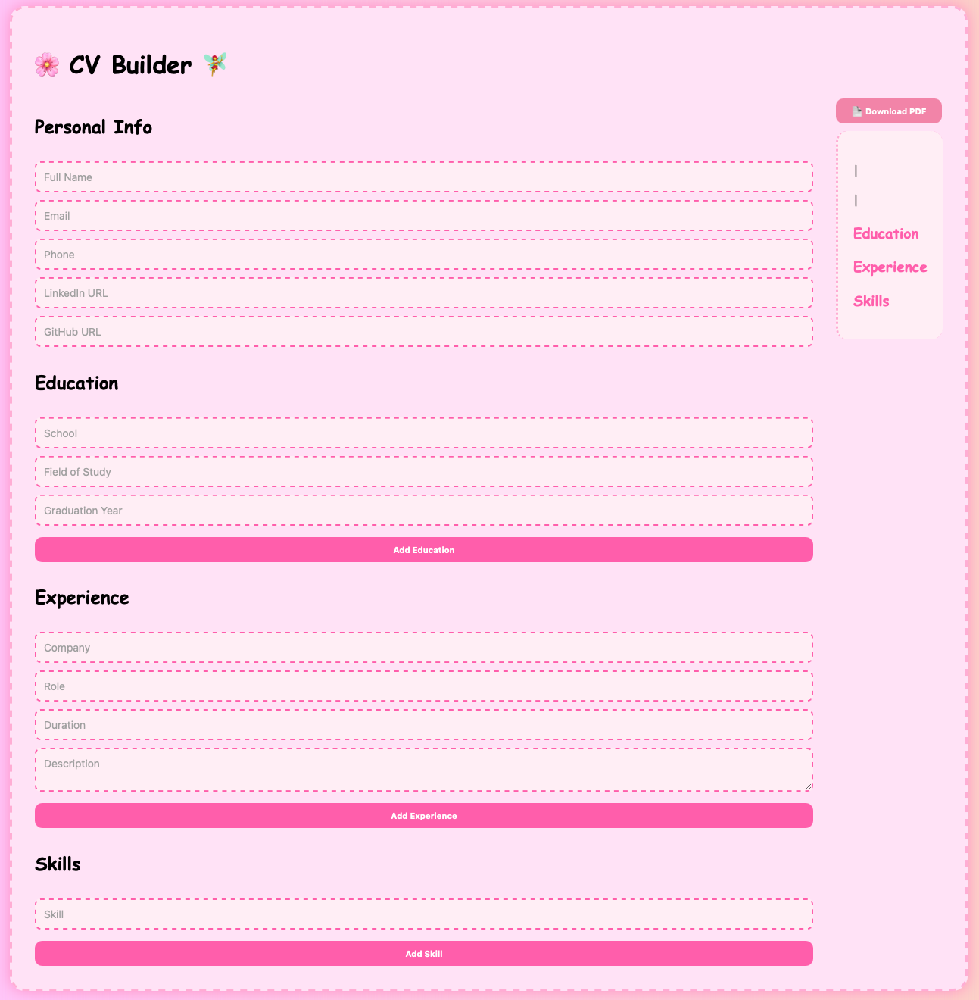

🌸 Fairycore CV Builder 📚✨
Create a charming and unique CV with a delightful fairycore theme! This adorable CV builder lets you fill in your details with a live preview and download your resume as a professional PDF.

✨ Features You'll Love
📄 Real-time CV Preview: See your changes instantly as you build your resume.

💾 PDF Export: Easily download your completed CV as a professional PDF.

🌸 Fairycore / Kawaii Style Interface: Enjoy a whimsical and cute design inspired by fairycore aesthetics.

📱 Clean, Responsive & Simple Design: A user-friendly interface that looks great on any device.

🚀 Get Started
Ready to build your magical CV? Follow these simple steps:

Clone the repository:

Bash
git clone (https://github.com/CeydaSerttas/CV-Builder-App.git)
Navigate to the project directory:

Bash
cd cv-builder
Install dependencies:

Bash
npm install
Start the application:

Bash
npm start

🖼️ Sneak Peek

